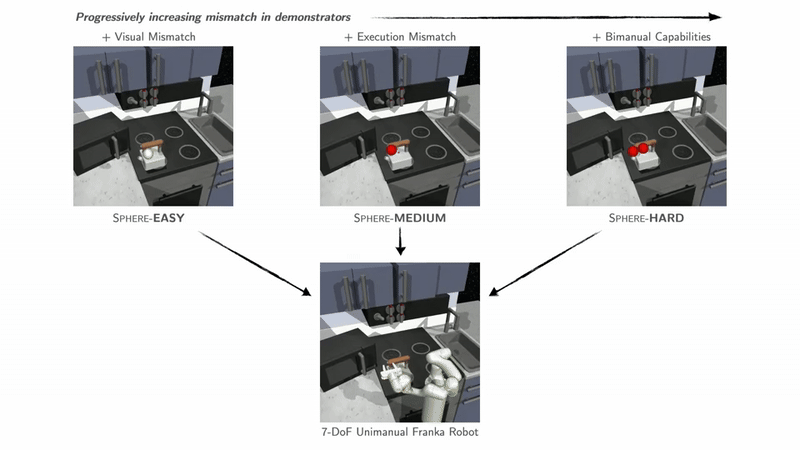

# One-Shot Imitation under Mismatched Execution


[Kushal Kedia](https://kushal2000.github.io/)<sup>\*</sup>,  [Prithwish Dan](https://pdan101.github.io/)<sup>\*</sup>, Angela Chao, Maximus A. Pace, [Sanjiban Choudhury](https://sanjibanc.github.io/) (<sup>*</sup>Equal Contribution)
<sup></sup>Cornell University


[Project Page](https://portal-cornell.github.io/rhyme/) | [Link to Paper](https://arxiv.org/pdf/2409.06615)


<p align="center">
  
</p>


## Simulation Dataset

All datasets will be loaded in the code using HuggingFace API.

Datasets can be found at: https://huggingface.co/datasets/prithwishdan/RHyME

<p align="center">
  
</p>

## Installation

Follow these steps to install `RHyME`:

1. Create and activate the conda environment:
   ```bash
   cd rhyme
   conda env create -f environment.yml
   conda activate rhyme
   pip install -e . 
   ```
2. Before running any scripts, make sure to set "base_dev_dir" to your working directory for the codebase. You may directly write this value into the config files under ./config/simulation, 
or alternatively override the argument in the command line when running scripts.


## Training 🏋️

RHyME consists of three steps:

### 1. 👁️ Training shared visual encoder

a) Pretrain visual encoder:
   ```bash
   python scripts/train_vision_encoder.py
   ```
   <details>
   <summary>Example configs for different demonstrator types</summary>
      
   ```bash
   python scripts/train_vision_encoder.py --config-name=easy_pretrain_hf
   python scripts/train_vision_encoder.py --config-name=medium_pretrain_hf
   python scripts/train_vision_encoder.py --config-name=hard_pretrain_hf
   ```
   </details>
   
   <details>
   <summary>Additional options</summary>

   ```bash
   Model.use_opt_loss (default=False)
   Model.use_tcc_loss (default=False)
   ```
   </details>
<br>


### 2. 🔗 Automatic pairing of cross-embodiment datasets

a) Compute sequence-level distance metrics and generate pairings from unpaired datasets using pre-trained visual encoder.
```bash
bash scripts/automatic_pairing.sh --pretrain_model_name <name> --checkpoint <num> --cross_embodiment <type> [--num_chops <num>] [--lookup_type <type>]
```

<details>
<summary>Required Parameters</summary>
- `--pretrain_model_name`: Folder name of vision encoder in ./experiment/pretrain
- `--checkpoint`: Checkpoint number
- `--cross_embodiment`: Dataset type (sphere-easy, sphere-medium, sphere-hard)
</details>

<details>
<summary>Optional Parameters</summary>

- `--num_chops`: Number of clips to retrieve per robot video (default: 4)
- `--lookup_type`: Type of lookup method to use (ot, tcc) (default: ot)
</details>

<details>
<summary>Breakdown of steps in bash script</summary>

a) Convert images into latent vectors using pretrained visual encoder: 
   ```bash
   python scripts/label_sim_kitchen_dataset.py
   ```
   <details>
   <summary>Additional options</summary>

   ```bash
   pretrain_model_name (Folder name of vision encoder in ./experiment/pretrain)
   ckpt (Checkpoint number)
   cross_embodiment (sphere-easy, sphere-medium, sphere-hard)
   ```
   </details>
<br>

b) Compute and store sequence-level distance metrics between cross embodiment play data and robot data:
   ```bash
   python scripts/chopped_segment_wise_dists.py
   ``` 
   <details>
   <summary>Additional options</summary>

   ```bash
   pretrain_model_name (Folder name of vision encoder in ./experiment/pretrain)
   ckpt (Checkpoint number) 
   num_chops (Number of clips to retrieve per robot video)
   cross_embodiment (sphere-easy, sphere-medium, sphere-hard)
   ```
   </details>
<br>

c) "Imagine" the paired demonstrator dataset:
   ```bash
   python scripts/reconstruction.py 
   ```
   <details>
   <summary>Additional options</summary>

   ```bash
   pretrain_model_name (Folder name of vision encoder in ./experiment/pretrain)
   ckpt (Checkpoint number) 
   num_chops (Number of clips to retrieve per robot video)
   cross_embodiment (sphere-easy, sphere-medium, sphere-hard)
   ot_lookup (default=True)
   tcc_lookup (default=False)
   ```
   </details>
<br>

d) Convert the imagined dataset into latent vectors:
   ```bash
   python scripts/label_retrieved_dataset.py
   ```
   <details>
   <summary>Additional options</summary>

   ```bash
   pretrain_model_name (Folder name of vision encoder in ./experiment/pretrain)
   ckpt (Checkpoint number) 
   imagined_dataset (Folder name of imagined dataset in ./datasets/kitchen_dataset)
   ```
   </details>
</details>
<br>

### 3. 🤖 Hybrid visuomotor policy training

a) Train conditional diffusion policy to translate imagined demonstrator videos into robot actions:
   ```bash
   python scripts/train_diffusion_policy.py
   ```
   <details>
   <summary>Additional options</summary>

   ```bash
   pretrain_model_name (Folder name of vision encoder in ./experiment/pretrain)
   pretrain_ckpt (Checkpoint number) 
   eval_cfg.demo_type (Specifies which demonstrator to evaluate on)
   cross_embodiment (Folder name of imagined dataset in ./datasets/kitchen_dataset)
   dataset.paired_data (True if using the imagined paired dataset)
   dataset.paired_percent (default=0, hybrid training on robot/imagined dataset - set to 0.5 for RHyME)
   ```
   </details>
<br>

## Evaluation 📊

a) Evaluate policy on unseen demonstrator videos:
   ```bash
   python scripts/eval_checkpoint.py
   ```
   <details>
   <summary>Additional options</summary>

   ```bash
   pretrain_model_name (Folder name of vision encoder in ./experiment/pretrain)
   pretrain_ckpt (Checkpoint number) 
   demo_type_list (Specifies which demonstrators to evaluate on)
   policy_name (Folder name of diffusion policy in ./experiment/diffusion_bc/kitchen)
   ```
   </details>
<br>


### BibTeX
   ```bash
   @article{
      kedia2024one,
      title={One-shot imitation under mismatched execution},
      author={Kedia, Kushal and Dan, Prithwish and Chao, Angela and Pace, Maximus Adrian and Choudhury, Sanjiban},
      journal={arXiv preprint arXiv:2409.06615},
      year={2024}
   }
   ``` 

### Acknowledgement
* Much of the training pipeline is adapted from [XSkill](https://xskill.cs.columbia.edu/).
* Diffusion Policy is adapted from [Diffusion Policy](https://github.com/real-stanford/diffusion_policy)
* Many useful utilies are adapted from [XIRL](https://x-irl.github.io/).
