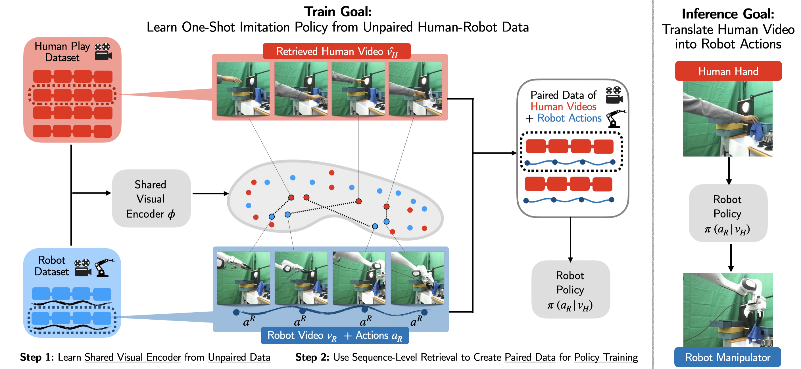

# One-Shot Imitation under Mismatched Execution

[](https://portal-cornell.github.io/rhyme/)
[](https://arxiv.org/pdf/2409.06615)

[Kushal Kedia](https://kushal2000.github.io/)<sup>\*</sup>,  [Prithwish Dan](https://pdan101.github.io/)<sup>\*</sup>, Angela Chao, Maximus A. Pace, [Sanjiban Choudhury](https://sanjibanc.github.io/) (<sup>*</sup>Equal Contribution)
<sup></sup>Cornell University

<!-- [Project Page](https://portal-cornell.github.io/rhyme/) | [Link to Paper](https://arxiv.org/pdf/2409.06615) -->


<p align="center">
  
</p>


## Simulation Dataset

All datasets will be loaded in the code using HuggingFace API.

Datasets can be found at: https://huggingface.co/datasets/prithwishdan/RHyME

<p align="center">
  
</p>

## Installation

Follow these steps to install `RHyME`:

1. Create and activate the conda environment:
   ```bash
   cd rhyme
   conda env create -f environment.yml
   conda activate rhyme
   pip install -e . 
   ```
2. Before running any scripts, make sure to set "base_dev_dir" to your working directory for the codebase. You may directly write this value into the config files under ./config/simulation, 
or alternatively override the argument in the command line when running scripts.


## Training 🏋️

RHyME consists of three steps:

### 1. 👁️ Training shared visual encoder

Run the following script to pretrain the visual encoder. By default, we use the Sphere-Easy dataset. 
   ```bash
   python scripts/train_vision_encoder.py
   ```
   For different demonstrator types, use these configs:
   ```bash
   python scripts/train_vision_encoder.py --config-name=easy_pretrain_hf
   python scripts/train_vision_encoder.py --config-name=medium_pretrain_hf
   python scripts/train_vision_encoder.py --config-name=hard_pretrain_hf
   ```
   
   <!-- <details>
   <summary>Additional options</summary>

   ```bash
   Model.use_opt_loss (default=False)
   Model.use_tcc_loss (default=False)
   ```
   </details> -->
<br>


### 2. 🔗 Automatic pairing of cross-embodiment datasets

Compute sequence-level distance metrics and generate pairings from unpaired datasets using pre-trained visual encoder:
```bash
bash scripts/automatic_pairing.sh --pretrain_model_name <name> --checkpoint <num> --cross_embodiment <type> 
```

Required Parameters:
- `--pretrain_model_name`: Folder name of vision encoder in ./experiment/pretrain
- `--checkpoint`: Checkpoint number
- `--cross_embodiment`: Dataset type (sphere-easy, sphere-medium, sphere-hard)

### 3. 🤖 Hybrid visuomotor policy training

Train conditional diffusion policy to translate imagined demonstrator videos into robot actions:

```bash
python scripts/train_diffusion_policy.py \
    --pretrain_model_name <name> \
    --pretrain_ckpt <num> \
    --eval_cfg.demo_type <type> \
```

Required Parameters:
- `pretrain_model_name`: Folder name of vision encoder in ./experiment/pretrain
- `pretrain_ckpt`: Checkpoint number 
- `eval_cfg.demo_type`: Dataset type (sphere-easy, sphere-medium, sphere-hard)
<br>

## Evaluation 📊

Evaluate policy on unseen demonstrator videos:
   ```bash
   python scripts/eval_checkpoint.py
   ```
   Key parameters:
   - `pretrain_model_name`: Folder name of vision encoder in ./experiment/pretrain
   - `pretrain_ckpt`: Checkpoint number 
   - `demo_type_list`: Specifies which demonstrators to evaluate on
   - `policy_name`: Folder name of diffusion policy in ./experiment/diffusion_bc/kitchen

### BibTeX
   ```bash
   @article{
      kedia2024one,
      title={One-shot imitation under mismatched execution},
      author={Kedia, Kushal and Dan, Prithwish and Chao, Angela and Pace, Maximus Adrian and Choudhury, Sanjiban},
      journal={arXiv preprint arXiv:2409.06615},
      year={2024}
   }
   ``` 

### Acknowledgement
* Much of the training pipeline is adapted from [XSkill](https://xskill.cs.columbia.edu/).
* Diffusion Policy is adapted from [Diffusion Policy](https://github.com/real-stanford/diffusion_policy)
* Many useful utilities are adapted from [XIRL](https://x-irl.github.io/).
